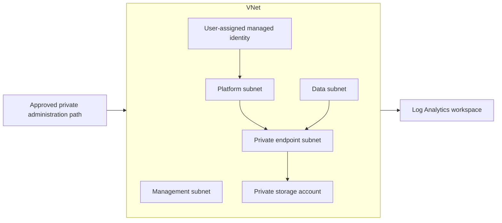

# Terraform Azure Enterprise Platform

A sanitized Terraform reference implementation for secure Azure platform foundations. The project demonstrates the design patterns I use for network segmentation, private endpoints, managed identities, role-based access control, centralized logs and ownership metadata.

## Capabilities demonstrated

- Resource groups and consistent enterprise tags
- Segmented virtual network for platform, data, private endpoint and management tiers
- Network security groups with intentional traffic boundaries
- User-assigned managed identity and scoped RBAC
- Log Analytics workspace and diagnostic settings
- Storage account with public network access and shared-key access disabled
- Private Endpoint and Private DNS integration for Blob Storage
- Typed variables, outputs and a synthetic environment example

## Technical case studies

Alongside the Terraform patterns, this repository includes sanitized write-ups from hands-on Azure troubleshooting and platform work:

- [Azure App Service custom container: trusting a private CA without rebuilding the image](docs/app-service-custom-container-ca-trust.md) — certificate injection with `WEBSITE_LOAD_CERTIFICATES`, DER-to-PEM conversion, Node.js `NODE_EXTRA_CA_CERTS`, startup-command troubleshooting and runtime validation.

## Architecture



## Repository layout

```text
.
├── providers.tf
├── variables.tf
├── network.tf
├── identity.tf
├── monitoring.tf
├── private-storage.tf
├── outputs.tf
├── examples/dev.tfvars
├── docs/architecture.md
└── docs/app-service-custom-container-ca-trust.md
```

## Quick start

Authenticate with an approved short-lived identity, then run:

```bash
terraform init
terraform fmt -check -recursive
terraform validate
terraform plan -var-file=examples/dev.tfvars
```

The supplied subscription ID is a zero-value placeholder. Replace it locally or set `ARM_SUBSCRIPTION_ID`; never commit a real subscription or tenant identifier to a public repository.

## Security decisions

- Blob Storage is reachable through a private endpoint rather than its public endpoint.
- Storage shared-key authorization is disabled to encourage Microsoft Entra identity.
- The managed identity receives only the monitoring role required by this example.
- Subnet NSGs deny unsolicited inbound traffic and allow only documented internal paths.
- Diagnostic settings send supported logs and metrics to Log Analytics.
- All resources carry ownership, department, environment, project and automation tags.

## Scope

This is a focused platform building block, not a complete enterprise landing zone. Management groups, policy assignments, subscription vending, hub firewalls, ExpressRoute, privileged identity management and centralized DNS are normally supplied by higher-level platform capabilities.

## Data-safety note

Every identifier, address and resource name is synthetic. The repository contains no employer subscription data, internal IP plan, production exports, credentials or proprietary architecture.
