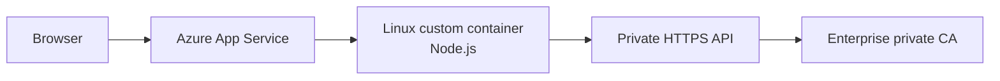

# Azure App Service Custom Container: Trusting a Private CA Without Rebuilding the Image

This case study documents a practical Azure App Service problem I worked through: a Linux custom container running Node.js needed to call an internal HTTPS service whose certificate chain was signed by a private enterprise CA.

The application itself was healthy, DNS and network routing were working, but outbound HTTPS calls from Node.js failed certificate validation because the private CA was not part of Node's default trust bundle.

The constraint that made the problem interesting was that I wanted to solve it at the App Service/runtime layer first, without rebuilding the application image.

> **Sanitization note:** Every application name, certificate thumbprint, URL, resource name and identifier in this document is synthetic. No employer-specific infrastructure, credentials, internal DNS names or certificate details are included.

## Problem

The workload looked like this:



The Node.js application could reach the private API at the network layer, but TLS verification failed because the API certificate chained to a private CA.

A tempting workaround would be to disable TLS verification, for example with `NODE_TLS_REJECT_UNAUTHORIZED=0`. I deliberately avoided that because it weakens TLS verification globally for the Node process.

The goal was instead:

1. Upload the enterprise CA certificate to App Service.
2. Make Azure expose it inside the custom container.
3. Convert the App Service-mounted certificate into a format Node can trust.
4. Start the real Node application with that CA added to its trust set.
5. Do all of this without modifying the image.

## What Azure App Service Gives You

Azure App Service can expose certificates uploaded to the App Service resource inside a Linux custom container.

For a public certificate, setting:

```text
WEBSITE_LOAD_CERTIFICATES=*
```

makes the certificate available under:

```text
/var/ssl/certs
```

The mounted certificate filename is based on its thumbprint. A typical path therefore looks like:

```text
/var/ssl/certs/AAAAAAAAAAAAAAAAAAAAAAAAAAAAAAAAAAAAAAAA.der
```

For tighter control, `WEBSITE_LOAD_CERTIFICATES` can contain specific certificate thumbprints instead of `*`.

Microsoft documents this behavior here:

- https://learn.microsoft.com/azure/app-service/configure-ssl-certificate-in-code

## The Node.js Detail That Matters

Node.js supports an additional CA bundle through:

```text
NODE_EXTRA_CA_CERTS=/path/to/ca.pem
```

There were two important details:

- `NODE_EXTRA_CA_CERTS` expects one or more trusted certificates in PEM format.
- Node reads `NODE_EXTRA_CA_CERTS` when the Node process starts. Setting it later inside an already-running Node process does not change that process's CA trust.

Node documents this behavior here:

- https://nodejs.org/api/cli.html#node_extra_ca_certsfile

This meant I could not simply start the application and then set `process.env.NODE_EXTRA_CA_CERTS` afterward. The PEM file had to exist **before the real application Node process was launched**.

## Solution Design

I used a tiny bootstrap Node process ahead of the real application process.

```mermaid
flowchart TD
    Upload[Upload public CA certificate to App Service] --> Load[WEBSITE_LOAD_CERTIFICATES]
    Load --> DER[Azure mounts certificate as DER\n/var/ssl/certs/<thumbprint>.der]
    DER --> Bootstrap[Bootstrap Node process]
    Bootstrap --> Convert[Convert DER certificate to PEM]
    Convert --> PEM[/tmp/enterprise-ca.pem]
    PEM --> Spawn[Spawn real Node application]
    Spawn --> ExtraCA[NODE_EXTRA_CA_CERTS=/tmp/enterprise-ca.pem]
    ExtraCA --> API[Private HTTPS API]
```

The key idea is that the bootstrap process does not make the business API calls. It only prepares the CA and launches the real application process with the correct environment.

## App Service Configuration

The App Service settings can be kept generic:

```text
WEBSITE_LOAD_CERTIFICATES=*
APP_CA_DER=/var/ssl/certs/AAAAAAAAAAAAAAAAAAAAAAAAAAAAAAAAAAAAAAAA.der
APP_CA_PEM=/tmp/enterprise-ca.pem
```

I also stored the bootstrap JavaScript itself in an App Service setting:

```text
APP_BOOTSTRAP_JS=<bootstrap JavaScript>
```

The reason for storing the script in an environment variable was an App Service startup-command parsing issue I encountered during troubleshooting.

## Why I Did Not Put the Whole Script in Startup Command

An early attempt placed a long inline script directly into the App Service Startup Command, similar to:

```text
node -e const fs=require('fs'); ...
```

The command was split in a way that caused Node to receive only the first token of the JavaScript program. The resulting error looked like:

```text
[eval]:1
const
^^^^^
SyntaxError: Unexpected end of input
```

Nested shell quoting produced similar failures.

The reliable pattern was to make the Startup Command intentionally tiny:

```text
node -e eval(process.env.APP_BOOTSTRAP_JS)
```

The full JavaScript then comes from the environment variable instead of being parsed as part of a complex startup command.

## Bootstrap Script

The sanitized bootstrap logic is:

```javascript
const fs = require('fs');
const crypto = require('crypto');
const cp = require('child_process');

const source = process.env.APP_CA_DER;
const destination = process.env.APP_CA_PEM || '/tmp/enterprise-ca.pem';

console.log(`CA source: ${source}`);

const certificate = new crypto.X509Certificate(fs.readFileSync(source));
fs.writeFileSync(destination, certificate.toString());

console.log(`CA prepared: ${certificate.subject}`);

const childEnvironment = {
  ...process.env,
  NODE_EXTRA_CA_CERTS: destination
};

const child = cp.spawn(
  process.execPath,
  ['dist/server/server.mjs'],
  {
    stdio: 'inherit',
    env: childEnvironment
  }
);

child.on('exit', (code, signal) => {
  if (signal) {
    process.kill(process.pid, signal);
  } else {
    process.exit(code ?? 1);
  }
});
```

`X509Certificate.toString()` returns the certificate in PEM encoding, which makes it suitable for the file referenced by `NODE_EXTRA_CA_CERTS`.

The application path in this example is deliberately synthetic. It must be changed to match the actual image's Node entry point.

## How I Validated the Certificate Was Really in the Application Container

One important troubleshooting lesson was not to confuse the App Service SCM/Kudu environment with the application container.

A certificate being visible in a management/debug container does not prove that the application container received it.

I therefore temporarily used the bootstrap to list the real application container directory:

```javascript
const fs = require('fs');

console.log(
  'CERT_DIR_CONTENTS=' +
  JSON.stringify(fs.readdirSync('/var/ssl/certs'))
);
```

The expected evidence was similar to:

```text
CERT_DIR_CONTENTS=["AAAAAAAAAAAAAAAAAAAAAAAAAAAAAAAAAAAAAAAA.der"]
```

That separated two questions cleanly:

1. **Did Azure mount the certificate?**
2. **Did Node trust the certificate?**

I only moved to the Node trust configuration after the first question was proven.

## Validation Sequence

My final validation sequence was:

```text
1. Upload CA certificate to App Service
        |
        v
2. Set WEBSITE_LOAD_CERTIFICATES
        |
        v
3. Restart App Service
        |
        v
4. Confirm /var/ssl/certs contains expected DER file
        |
        v
5. Bootstrap converts DER -> PEM
        |
        v
6. Bootstrap launches application with NODE_EXTRA_CA_CERTS
        |
        v
7. Confirm application starts normally
        |
        v
8. Test the real outbound HTTPS call
```

Typical success logging can be as simple as:

```text
CA source: /var/ssl/certs/AAAAAAAAAAAAAAAAAAAAAAAAAAAAAAAAAAAAAAAA.der
CA prepared: CN=Example Enterprise Root CA
Node application listening on port 8080
```

Do not print certificate contents, access tokens, client secrets or other sensitive application configuration into logs.

## Why This Worked Without an Image Rebuild

The custom image already had Node.js and a valid application entry point. The only missing piece was runtime trust of the private CA.

App Service provided the certificate file, while the bootstrap process handled the format conversion and process ordering required by Node.js.

That kept the responsibilities separated:

```text
Azure App Service
    -> certificate lifecycle and injection

Bootstrap process
    -> DER-to-PEM preparation
    -> launch ordering

Node application
    -> normal application workload
```

This is useful when an immediate runtime remediation is needed and rebuilding an application image is undesirable or controlled by a different delivery team.

## Security Decisions

### Do not disable TLS verification

Avoid:

```text
NODE_TLS_REJECT_UNAUTHORIZED=0
```

The requirement is to teach the application to trust the correct enterprise CA, not to trust every certificate.

### Prefer a specific certificate thumbprint where practical

`WEBSITE_LOAD_CERTIFICATES=*` is convenient during troubleshooting, but a production implementation can specify only the certificate thumbprint(s) the application needs.

### Keep certificate trust separate from application secrets

The public CA certificate is not a secret. API credentials, bearer tokens, private keys and client secrets are different and must still be protected separately.

### Be aware of explicit TLS `ca` options

Node's `NODE_EXTRA_CA_CERTS` does not apply when application code explicitly supplies a `ca` option to a TLS/HTTPS client. If a library constructs its own CA set, inspect that client configuration separately.

## Troubleshooting Lessons

### 1. Verify the exact certificate thumbprint

A single incorrect character means the expected file path will not exist. Validate the thumbprint from the App Service certificate registration instead of typing it from memory.

### 2. Prove certificate injection before debugging Node trust

First prove:

```text
/var/ssl/certs/<thumbprint>.der
```

exists in the real application container.

Then debug PEM conversion and Node trust.

### 3. Keep the Startup Command simple

Complex shell quoting can create misleading failures before the certificate code even executes.

The environment-variable bootstrap pattern reduced the startup command to:

```text
node -e eval(process.env.APP_BOOTSTRAP_JS)
```

### 4. Remember process-start semantics

This does **not** solve the problem for the current process:

```javascript
process.env.NODE_EXTRA_CA_CERTS = '/tmp/enterprise-ca.pem';
```

The real application process must start after the PEM file exists, with `NODE_EXTRA_CA_CERTS` already present in its environment.

### 5. Separate network failures from TLS failures

Before changing certificate trust, independently verify:

- DNS resolution
- route/reachability
- TCP 443 connectivity
- TLS certificate verification
- HTTP/application response

A TLS error should not be treated as proof of a routing failure, and a successful TCP connection should not be treated as proof that TLS trust is correct.

## When I Would Prefer an Image-Level Fix

The runtime bootstrap is useful, but it is not always the final desired state.

If the private CA is a permanent dependency of the application and the delivery process allows it, baking the enterprise CA trust into a controlled application base image can simplify startup behavior and make trust configuration part of the application artifact.

The App Service bootstrap approach is particularly valuable when:

- the CA is managed independently from application releases;
- the image cannot be rebuilt immediately;
- certificate rotation needs to remain an App Service/platform concern;
- the application already supports a stable server-side Node entry point.

## References

- Microsoft Learn — Use TLS/SSL certificates in app code: https://learn.microsoft.com/azure/app-service/configure-ssl-certificate-in-code
- Node.js — `NODE_EXTRA_CA_CERTS`: https://nodejs.org/api/cli.html#node_extra_ca_certsfile
- Node.js — `X509Certificate`: https://nodejs.org/api/crypto.html#class-x509certificate

## Takeaway

The hard part was not simply "uploading a certificate." The real solution required understanding where Azure mounted the certificate, the encoding Node expected, when Node reads its CA configuration, how the container entry point behaved, and how App Service parsed the startup command.

The resulting pattern is small, repeatable and keeps TLS verification enabled while allowing a Node.js custom container on Azure App Service to trust a private enterprise CA without an immediate image rebuild.
