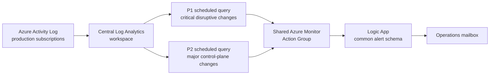

# Azure production change monitoring and alerting

A sanitized case study showing how I designed and validated a production-grade Azure control-plane change monitoring pipeline for a regulated enterprise environment.

> **Data-safety note:** every resource name, identifier, address and organization reference in this write-up is synthetic or generic. No employer names, tenant IDs, subscription IDs, internal IP addresses, email addresses, production exports or credentials are included.

## Problem

Azure Activity Log provides excellent control-plane audit data, but raw Activity Log alerts quickly become noisy and difficult for an operations team to use at scale. The goal was to build a centralized design that could answer five questions quickly:

1. What changed?
2. Who or what made the change?
3. Which production resource was affected?
4. How serious is the change?
5. Can the alert be trusted to arrive even when Activity Log ingestion is delayed?

The final design separates disruptive changes from important control-plane changes, enriches automated identity events where useful, and sends concise formatted email notifications through a shared notification path.

## Architecture



The delivery path is shared; detection policy remains separate so severity, suppression and query logic can be tuned independently.

## Severity model

### P1 — critical disruptive change

P1 is reserved for actions with an immediate or plausible outage impact, for example:

- resource stop, restart, shutdown or deallocation
- production resource deletion
- network control-plane writes or deletes
- route, NSG, firewall, load balancer or application-gateway changes
- other operations explicitly classified as service-disruptive

P1 characteristics:

- Azure Monitor severity: `Sev0`
- evaluation frequency: 5 minutes
- query window: 1 hour
- fresh-ingestion eligibility: 15 minutes
- no action mute; critical changes should not be intentionally suppressed
- formatted notification uses a red visual treatment

### P2 — major control-plane change

P2 captures important production administration that may not immediately cause an outage but is still operationally or security significant, for example:

- RBAC role assignment and definition changes
- Azure Policy changes
- resource locks
- diagnostic settings and alerting configuration
- application configuration updates
- Key Vault, storage and database control-plane changes
- managed identity changes
- selected resource-group and platform configuration writes

P2 characteristics:

- Azure Monitor severity: `Sev2`
- evaluation frequency: 5 minutes
- query window: 1 hour
- fresh-ingestion eligibility: 15 minutes
- 15-minute action mute to reduce repetitive notifications from bursty automation
- formatted notification uses an amber visual treatment

## Reliability lesson: do not match the freshness gate to the scheduler cadence

The first version used:

```kusto
| where ingestion_time() > ago(5m)
```

with a scheduled-query evaluation frequency of five minutes.

That creates almost no safety margin. An Activity Log record can arrive in Log Analytics several minutes after the actual Azure operation. If the next scheduled-query execution is slightly delayed, the event can age out of the five-minute ingestion filter before Azure Monitor evaluates it.

The corrected pattern separates scheduler cadence from freshness tolerance:

```kusto
let RuleInterval = 5m;
let MaxIngestionDelay = 20m;
let FreshIngestionWindow = 15m;

AzureActivity
| where TimeGenerated >= ago(MaxIngestionDelay + FreshIngestionWindow)
| where ingestion_time() > ago(FreshIngestionWindow)
```

This gives each newly ingested event multiple evaluation opportunities while still avoiding repeated scans of old data.

The scheduled-query rule itself uses a one-hour window so the Azure Monitor query boundary is comfortably larger than the KQL event-time lookback.

## Duplicate control

The detector is intentionally stateless because a later identical control-plane operation can still be operationally meaningful.

Within the query, exact duplicates generated by Activity Log are collapsed using a stable hash of the record and `arg_max()`. P2 additionally uses an action mute because deployment automation can emit several equivalent configuration writes in a short period.

The design does **not** use high-cardinality GUIDs such as correlation IDs as alert split dimensions. Split dimensions are reserved for fields that improve the operator-facing notification:

1. caller
2. source IP
3. friendly operation
4. impacted resource group
5. impacted subscription
6. raw Azure operation

## Actor enrichment

Raw Azure Activity Log callers can be users, managed identities, service principals or Microsoft platform services.

The query normalizes known automation identities into readable descriptions while retaining the raw caller value in the query output for investigation. Generic examples include:

- deployment pipeline
- backup service
- platform resource provider
- privileged identity management service

Automation is not automatically suppressed. A deployment pipeline that changes production application configuration is still a useful P2 signal.

## PIM enrichment

A particularly useful enrichment is Privileged Identity Management activity.

Azure Activity Log can show the PIM service as the caller for role-assignment removal, which is technically correct but not enough for an operator. Entra `AuditLogs` can identify whether the event was a time-bound PIM expiry and which user was affected.

The robust correlation key is the Azure RBAC role-assignment resource ID rather than only the affected principal ID. That avoids accidentally joining the wrong PIM operation if one user has multiple role events in a short period.

Conceptually:

```kusto
let PIMAudit =
    AuditLogs
    | where Result =~ "success"
    | where OperationName has "PIM"
    | mv-expand Detail = todynamic(AdditionalDetails)
    | where tostring(Detail.key) in ("OriginRoleAssignmentId", "RoleAssignmentRequestId")
    | extend PIMRoleAssignmentId = tolower(tostring(Detail.value))
    // extract affected user from TargetResources
    ;

AzureActivity
// extract role-assignment resource ID
| join kind=leftouter PIMAudit
    on $left.ActivityRoleAssignmentId == $right.PIMRoleAssignmentId
```

The resulting operator-facing message can distinguish a normal RBAC deletion from an automatic PIM expiry without hard-coding a specific user.

## Notification design

Both rules send the Azure Monitor common alert schema to one Action Group and one Logic App.

The Logic App builds a compact HTML email containing:

- severity and color treatment
- performed-by identity
- source IP
- friendly operation
- resource group
- subscription
- affected resource
- detection timestamp
- alert rule
- raw Azure operation for technical investigation

The shared Logic App selects the visual treatment from `data.essentials.severity`:

- `Sev0` → critical/red
- `Sev2` → major/amber

This kept notification formatting centralized without coupling P1 and P2 detection policy.

## Validation approach

The solution was validated progressively rather than by intentionally creating a production outage.

### 1. Query validation

Historical AzureActivity data was used to prove:

- inclusion and exclusion logic
- caller normalization
- friendly operation names
- duplicate handling
- PIM correlation

### 2. Notification-path validation

The Action Group and Logic App were exercised using the common alert schema before relying on a live detector.

### 3. Genuine low-risk production validation

A harmless metadata/tag update on an existing resource group generated a real `Microsoft.Resources/subscriptions/resourceGroups/write` control-plane event.

The event was traced through:

```text
Azure control-plane operation
        ↓
Azure Activity Log
        ↓
central Log Analytics ingestion
        ↓
P2 scheduled-query match
        ↓
Azure Monitor alert instance
        ↓
Action Group
        ↓
Logic App
        ↓
formatted amber notification
```

This test also exposed the five-minute freshness race described earlier. After increasing the fresh-ingestion window, the same low-risk validation pattern completed successfully end to end.

P1 was hardened with the same reliability pattern, but no disruptive production action was created solely to test a Sev0 alert.

## Operational runbook

### Check recent Azure Activity Log

```bash
az monitor activity-log list \
  --subscription "<subscription-id>" \
  --resource-group "<resource-group>" \
  --offset 1h \
  --max-events 50 \
  -o table
```

### Confirm an exact event reached Log Analytics

```kusto
AzureActivity
| where CorrelationId == "<correlation-id>"
| project
    TimeGenerated,
    IngestedAt = ingestion_time(),
    Caller,
    CallerIpAddress,
    OperationNameValue,
    ActivityStatusValue,
    ResourceGroup,
    CorrelationId
```

### Measure ingestion lag

```kusto
AzureActivity
| extend IngestedAt = ingestion_time()
| extend IngestionLagSeconds = tolong((IngestedAt - TimeGenerated) / 1s)
| project TimeGenerated, IngestedAt, IngestionLagSeconds, OperationNameValue
```

### Inspect a scheduled-query rule

```bash
az rest \
  --method get \
  --url "https://management.azure.com/subscriptions/<management-subscription-id>/resourceGroups/<alert-rg>/providers/Microsoft.Insights/scheduledQueryRules/<rule-name>?api-version=2021-08-01" \
  -o json
```

### Check recent Logic App runs

```bash
az rest \
  --method get \
  --url "https://management.azure.com/subscriptions/<management-subscription-id>/resourceGroups/<automation-rg>/providers/Microsoft.Logic/workflows/<logic-app-name>/runs?api-version=2019-05-01&%24top=10" \
  -o table
```

### Troubleshooting order

When an email is missing, isolate the pipeline in this order:

1. confirm the Azure control-plane event exists
2. confirm the event reached the central Log Analytics workspace
3. run the detector query directly against the exact event
4. confirm Azure Monitor created an alert instance
5. confirm the Action Group references the expected receiver
6. inspect Logic App run history
7. inspect the mail connector only after the previous stages are proven

This prevents troubleshooting the mail layer when the real issue is ingestion or detector timing.

## Design trade-offs

| Decision | Reason |
|---|---|
| Separate P1 and P2 rules | Severity and suppression policy are fixed at rule level and should be independently tunable. |
| Shared Action Group and Logic App | Avoid duplicated notification plumbing and formatting logic. |
| 15-minute freshness window with 5-minute evaluation | Provides multiple evaluation opportunities and tolerates ingestion jitter. |
| No P1 action mute | Prefer a duplicate critical alert over suppressing a second disruptive change. |
| P2 action mute | Reduces repetitive deployment/configuration notifications. |
| PIM join by role-assignment ID | More exact than joining only on affected user/principal. |
| No GUID alert dimensions | Avoid high-cardinality alert series and keep operator-facing dimensions useful. |
| Low-risk validation | Proves the full production path without intentionally causing an outage. |

## What this demonstrates

This case study demonstrates hands-on experience with:

- Azure Monitor scheduled-query rules
- Azure Activity Log and Log Analytics
- KQL reliability and deduplication design
- Entra AuditLogs and PIM investigation
- Azure Monitor common alert schema
- Action Groups and Logic Apps
- Office 365 notification automation
- production-safe validation
- failure-domain isolation and evidence-driven troubleshooting
- balancing observability fidelity against alert fatigue

The important engineering outcome was not merely creating an alert rule; it was building a notification path that remained useful under real ingestion delay, automation noise and privileged-access workflows.